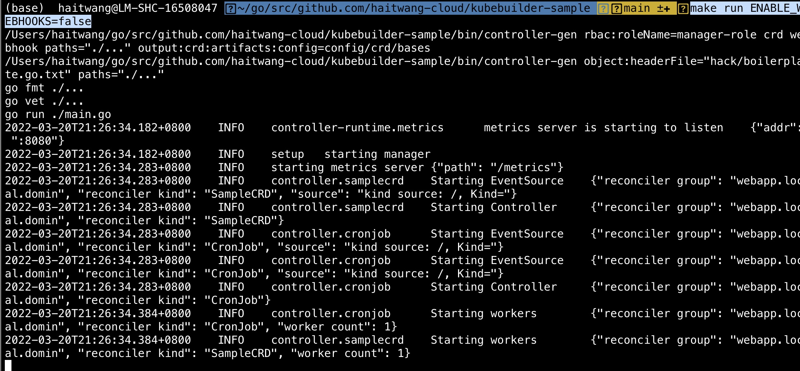
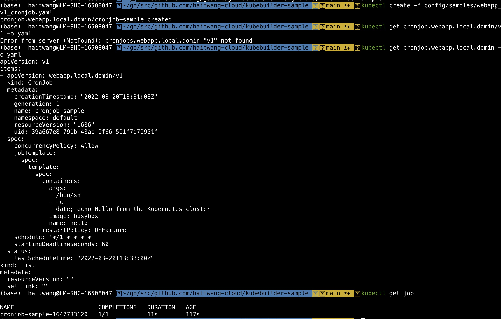
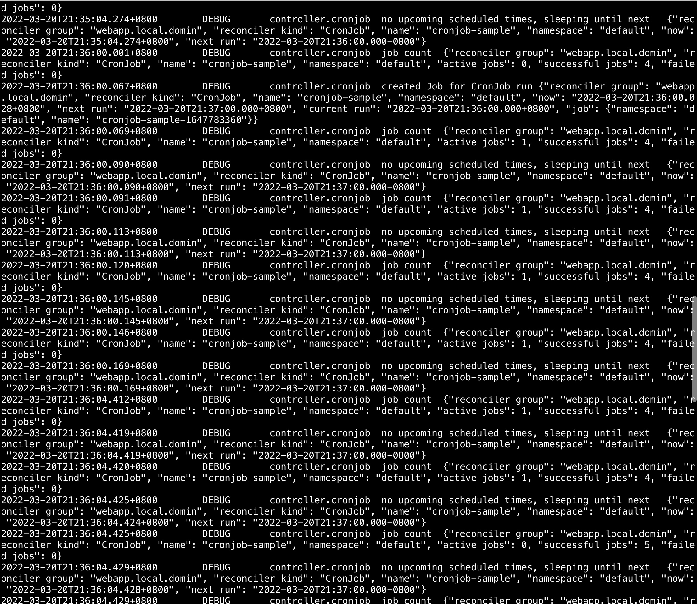

# kubebuilder-sample

## Basic

### Install
Follow the quick start start of [Kubebuilder](https://book.kubebuilder.io/quick-start.html?highlight=go,version#prerequisites)
### Init Project
- Run the following command
```sh
kubebuilder init --domain local.domin --repo github.com/haitwang-cloud/kubebuilder-sample
```
> Add "--skip-go-version-check" flag if u met pre-scaffold issue

- Project tree after init

```sh
.
├── Dockerfile
├── Makefile
├── PROJECT
├── README.md
├── config
│   ├── default # default config
│   │   ├── kustomization.yaml
│   │   ├── manager_auth_proxy_patch.yaml
│   │   └── manager_config_patch.yaml
│   ├── manager # yaml for deploy
│   │   ├── controller_manager_config.yaml
│   │   ├── kustomization.yaml
│   │   └── manager.yaml
│   ├── prometheus # metrics related
│   │   ├── kustomization.yaml
│   │   └── monitor.yaml
│   └── rbac
│       ├── auth_proxy_client_clusterrole.yaml
│       ├── auth_proxy_role.yaml
│       ├── auth_proxy_role_binding.yaml
│       ├── auth_proxy_service.yaml
│       ├── kustomization.yaml
│       ├── leader_election_role.yaml
│       ├── leader_election_role_binding.yaml
│       ├── role_binding.yaml
│       └── service_account.yaml
├── go.mod
├── go.sum
├── hack
│   └── boilerplate.go.txt
└── main.go
```
### Create an API

- Run the following command to create a new API (group/version) as webapp/v1 and the new Kind(CRD) SampleCRD on it:

```sh
kubebuilder create api --group webapp --version v1 --kind SampleCRD
```

- we can notice that a new controllers directory was created in the project
```sh
├── controllers
│   ├── samplecrd_controller.go # write controller logic here
│   └── suite_test.go # related test cases for controller
```
- Change controller logic
```sh
func (r *SampleCRDReconciler) Reconcile(ctx context.Context, req ctrl.Request) (ctrl.Result, error) {
	_ = log.FromContext(ctx)

	log := r.Log.WithValues("SampleCRD", req.NamespacedName)
	log.Info("Reconciling SampleCRD")
	return ctrl.Result{}, nil
}
```

### Running locally

#### Run the following command to run locally
```sh
make install
make run
```

## Advanced

### Create an API

- Run the following command to create a new API (group/version) as webapp/v1 and the new Kind(CRD) CronJob on it:

```sh
kubebuilder create api --group webapp --version v1 --kind CronJob
```

### Add webhook

- Run the following command to create a new webhook for the the API CronJob :

```sh
kubebuilder create webhook --group webapp --version v1 --kind CronJob --defaulting --programmatic-validation

```

### Running locally

#### Run the following command to run locally
```sh
make install
make run ENABLE_WEBHOOKS=false
```


#### Run the following command to test CRD
```sh
kubectl create -f config/samples/webapp_v1_cronjob.yaml
kubectl get cronjob.webapp.local.domin -o yaml
kubectl get job
```

Cronjob logs:
